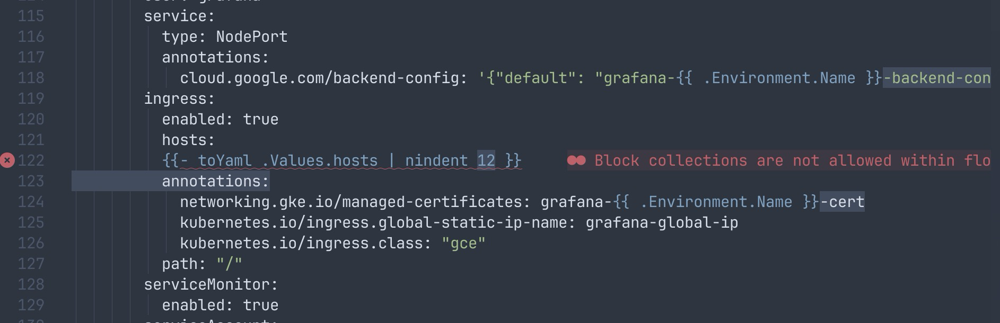
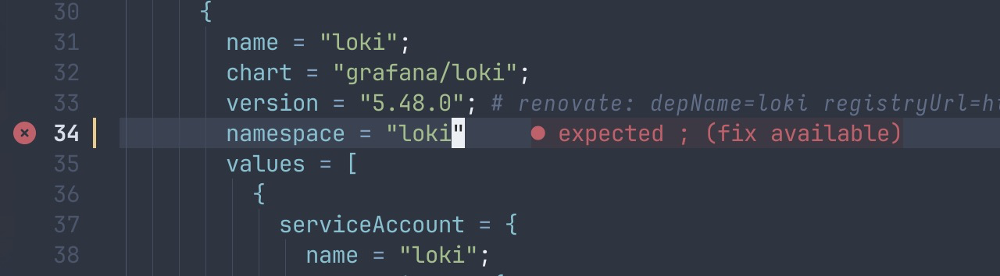
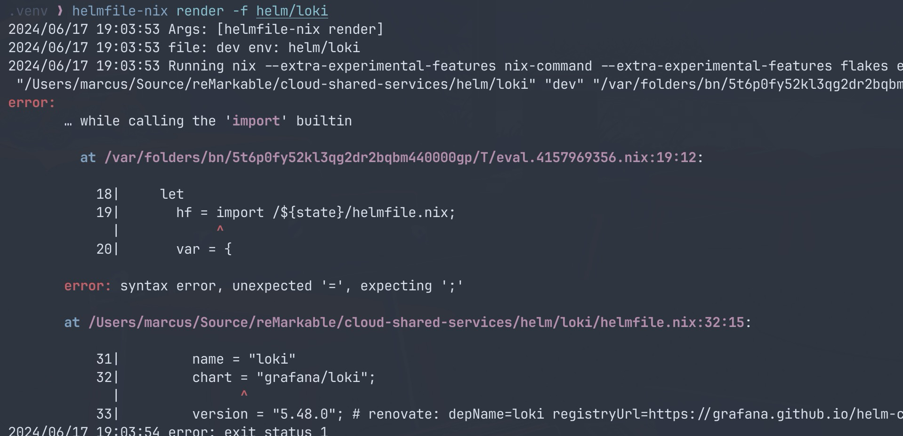

# <!--fit--> helmfile-nix

_by Marcus Ramberg - reMarkable Cloud Services_

<!--
Welcome to this talk about my side-project from this winter to rethink how we manage state in
our Kubernetes clusters.

reMarkable runs a lot of tooling to support our developers, including many Atlantis instances,
the LGTM stack and things like codecov in kubernetes. We use Helmfile to manage these deployments,
which has allowed us to manage a large number of deployments across multiple environments.

However, in long term maintenance, Helmfile has some challenges, and we wanted to see if we could
improve the situation. This talk is about how we did that.
-->

---

# A bit of background

* Helm is the most common package manager for Kubernetes.
* It allows you to define, install, and manage Kubernetes applications.
* Helm uses charts to define the resources that make up an application.
  (deployments/services/configmaps etc.)


<!--
So, why are we using Helm?
-->

---

The charts are a collection of go templates that define a set of Kubernetes resources

```gotemplate
{{- if (and (not .Values.useStatefulSet) (or (not .Values.persistence.enabled) (eq .Values.persistence.type "pvc"))) }}
apiVersion: apps/v1
kind: Deployment
metadata:
  name: {{ include "grafana.fullname" . }}
  namespace: {{ include "grafana.namespace" . }}
  labels:
    {{- include "grafana.labels" . | nindent 4 }}
    {{- with .Values.labels }}
    {{- toYaml . | nindent 4 }}
    {{- end }}
  {{- with .Values.annotations }}
  annotations:
    {{- toYaml . | nindent 4 }}
  {{- end }}
...
```

They aren't super pleasant to write, but almost all open-source projects provide them,
so consuming them is by far the most time efficient way to deal with app deployment.

---

Each chart can be customized using values

```yaml
name: my-grafana
serviceAccount:
  enable: true
autoscaling:
  enabled: true
  minReplicas: 1
  maxReplicas: 6
  targetCPU: "66"
```

<!--
These values arge merged down to te default values in the chart, and then the templates are rendered
-->

---

# Helm imperative workflow

```shell
❯ helm repo add grafana https://grafana.github.io/helm-charts

"grafana" has been added to your repositories
```

<!--
So lets look at how helm works when you use it directly

First, let's add a repository
-->
---

```shell
❯ helm install my-grafana grafana/grafana --values values.yaml

NAME: my-grafana
LAST DEPLOYED: Sun Jun 16 23:41:58 2024
NAMESPACE: default
STATUS: deployed
REVISION: 1
NOTES:
1. Get your 'admin' user password by running:

   kubectl get secret --namespace default my-grafana -o jsonpath="{.data.admin-password}" | base64 --decode ; echo


2. The Grafana server can be accessed via port 80 on the following DNS name from within your cluster:

   my-grafana.default.svc.cluster.local

   Get the Grafana URL to visit by running these commands in the same shell:
     export POD_NAME=$(kubectl get pods --namespace default -l "app.kubernetes.io/name=grafana,app.kubernetes.io/instance=my-grafana" \
     -o jsonpath="{.items[0].metadata.name}")
     kubectl --namespace default port-forward $POD_NAME 3000

3. Login with the password from step 1 and the username: admin
```

<!--
Then we install the chart using the values we defined earlier
-->

---

```shell
❯ helm list -o json|jq
[
  {
    "name": "my-grafana",
    "namespace": "default",
    "revision": "1",
    "updated": "2024-06-16 23:41:58.954191803 +0200 CEST",
    "status": "deployed",
    "chart": "grafana-7.3.7",
    "app_version": "10.4.0"
  }
]
```
<!-- 
helm keeps some metadata about the deployed charts in the cluster to allow query and rollback
-->
---

There are many ways to manage your Helm charts

* Using the Helm CLI directly like we just did
* GitOps operators like ArgoCD and Flux
  * Most of these work by expanding the Helm chart to YAML and then applying it to the cluster
* Helmfile
* helm / helmfile terraform provider
* and many more (Skaffold/Helmsman [etc](https://github.com/cdwv/awesome-helm?tab=readme-ov-file#tools-extras))

<!--
Terraform could have been a natural choice for us given our heavy use, but in practice, it's not great for managing Kubernetes resources due to some lifecycle issues. Helmfile has been a great fit for us.
-->

---

## Typically a challenge with Helm is managing multiple environments without a lot of duplication in your value files

# This is where Helmfile comes in handy


---

# It's a declarative way to manage your Helm charts

```gotemplate
environments:
  production:
    values:
      - environment/prod.yaml
  staging:
    values:
      - environment/staging.yaml
---
repositories:
  - name: grafana
    url: https://grafana.github.io/helm-charts
releases:
  - name: my-grafana
    chart: grafana/grafana
    version: 7.3.7
    installed: {{ .Environment.Values.installed }}
    values:
      - values.yaml
      - hostname: https://grafana-{{ .Environment.name }}.example.com
```

---

# This allows you to manage multiple environments in a fully declarative way

```shell
helmfile -e prod apply # Will apply any changes in the prod environment
```
### Allows a simple PR based flow where you can see the changes before they are applied

---

# Helmfile has a bunch of useful features for operations

* See planned changes before they are applied with the helm-diff plugin
* Supports modularization (Include remote helmfiles)
* Allows advanced workflows like rollback on failure
* Fetch values from external sources like SSM or terraform using vals
* Allows transparently applying kustomizations to your charts
* Can include charts from multiple sources, including local charts, and OCI registries

<!-- In practice we've found that helmfile is flexible enough to allow us to solve most configuration management challenges we've faced -->

---

# <!--fit--> Helmfile is great, but...

---

#### It's YAML...

```yaml
# 🚨 Anyone who uses YAML long enough will eventually get burned when attempting to abbreviate Norway 🚨
# `NO` is parsed as a boolean type, which with the YAML 1.1 spec, there are 22 options to write "true" or "false."
# You have to wrap "NO" in quotes to get the expected result.
NI: Nicaragua
NL: Netherlands
NO: Norway # 💣!

# 🚨 Anyone wondering why their first seven Kubernetes clusters deploy just fine, and the eighth fails? 🚨
- 07
- 08
# Results in
[ 7, "08" ]

# YAML knows that, when you have something that looks like the time of day,
# what you _really_ wanted is the time of seconds since midnight
timeOfDay:
  whatYouWrote: 04:30 # And when you parse this file and serialize it again, you get ...
  whatYouSurelyMeant: 16200 # Have fun debugging this one!
  whatYouShouldHaveWritten: !!str 04:30

# YAML is the super best way to encode Octal (tm) and learning the hard way that Kubernetes uses YAML 1.1
# is a DevOps rite of passage. Below YAML 1.2 a large integer is automatically converted to octal.
- YAML 1.1 uses `0666` notation.
- YAML 1.2 uses `0o666` notation
# Speaking of CI, did you know that 8-character SHAs could be all numbers?
# If the system that parses `my.flaky_version` is typed, it will happily explode 2% of the time.
my:
    # this will be a string ~98% of the time
    flaky_version: ${GIT_SHORT_SHA}
    # this will be a string ~100% of the time
    string_version: "${GIT_SHORT_SHA}"
```
<!--
YAML is a pretty complex spec and it has some sharp edges.
Not going to get into details as I guess most of you've felt the YAML pain
Newer versions of YAML have fixed some of these issues, but not all tools support them
-->

---


---

# And multiple levels of go templating

* Basically PHP for YAML
* Keep guessing how many levels of `nindent` you need
* Accidentally de-indent a block and wonder why your values aren't applied



---

# Impossible to get good IDE tooling

* Two interleaved languages
* No formatting/linting
* Debugging an error in your template can be a nightmare
  * Results might not be valid YAML
  * Have to go into debug mode to see why we're generating unexpected resources
* Complex flows are hard to reason about
  * For instance, we run many Atlantis instance, with small differences between them
  * Managing this with helmfile is hard

---

# What if we could have the best of both worlds?

* A minimal language to generate our configuration
* LSP based IDE Tooling
* Auto formatting/Linting
* Always generate valid YAML


---

# What is Nix?

* A purely functional package manager
* Driven by a simple DSL that can be used to define packages and configurations
* Powers the NixOS Linux distribution, as well as nix-darwin/home-manager/++


<!-- 
A bit different from traditional package managers like apt/yum/brew
Packages are created in a declarative way, and the package manager ensures that the dependencies are met
-->

---

# The nix expression language

* A Minimal DSL
* Purely functional
* Built for declarative configuration management
* Can natively output JSON (which is a subset of YAML)

<!--
A bit similar to terraform's HCL, but with a more functional approach
-->

---

## helmfile-nix is a tool that allows you to define your Helmfile as Nix expressions

* Transparently wraps the Helmfile CLI
* Pre-renders the Helmfile using nix eval
* Adds a single `render` subcommand to helmfile to see the rendered YAML
* Written in go, generates YAML using `yaml/v3`

---

# So how does it look like? (Slightly simplified to fit)

```nix
{ var, lib, ... }:
[ {
    repositories = [ {
        name = "grafana";
        url = "https://grafana.github.io/helm-charts";
    } ];
    releases = [
      {
        name = "grafana";
        chart = "grafana/grafana";
        installed =  var.environment.name == "prod";
        version = "7.3.9";
        values = [ {
            ingress = {
              enabled = true;
              hosts = var.values.hosts;
              annotations = {
                "networking.gke.io/managed-certificates" = "grafana-${var.environment.name}-cert";
              };
     ...
```
<!-- 
  Instead of templates, variables are first class values passed into the function
  Each function returns a single value, in this case a list of yaml documents to be rendered
  The nix string replacement allows any nix value to be inserted into a string, even nested string replacments
  
-->
---

# LSP support

- Instant error checking
- Goto definition
- Format on save
- Autocompletion



---

## By forcing direct evaluation of the config, we get good stack traces.




--- 

# Migration

* Rewriting your helmfile can be a daunting task
* Luckily there are tools to help you
* `https://github.com/euank/yaml2nix` can help you convert your YAML to nix
* Some pre/post processing will be needed, but quicker than rewriting from scratch
* Since the output is the same, you can use template/diff to ensure your port is correct
* We were able to gradually migrate all our helmfiles over a few weeks

---

# Some challenges I faced during development


---

# First prototype in python

* Turns out python is not great for this
* Hard to handle async subprocesses
* YAML generation in python had compatibility issues
* Python dependencies are not fun to handle
* Rewrite in Go overcame all these issues


---

# nixpkgs is big, and we only need the lib

* nixpkgs contains more than 100.000 packages
* Can be slow to fetch
* [nix-community/nixpkgs.lib](https://github.com/nix-community/nixpkgs.lib)
* automatically filtered version of nixpkgs only containing the functions

---

# No native YAML support

* Well, actually, but not in the way we want
* toYAML is simply an alias for `builtins.toJSON`
* Initially, I used yq as a derivation, but that requires a full nixpkgs, which makes container images large and keeps a
  lot of moving state
* In order to generate YAML that helmfile can consume, we now use the
  same yaml/v3 library that helmfile uses. Avoids any external dependencies
* helmfile-nix only requires the nix binary
* This is still a bit of a challenge for us in places where the actual value needs to be YAML too
* There's an [open PR](https://github.com/NixOS/nix/pull/7340) for native YAML support in nix

---

# Difficult to make a lean docker image

* You can build docker images using nix, but typically derivations are not optimized for size
* We use a multi-stage build to keep the image small
* Build the go binary a static nix binary, then copy them into alpine

---

```Dockerfile
FROM --platform=${BUILDPLATFORM:-linux/amd64} nixos/nix:2.22.0 AS nix

RUN nix build --extra-experimental-features nix-command --extra-experimental-features flakes 'nixpkgs#nixStatic'

FROM --platform=${BUILDPLATFORM:-linux/amd64} alpine:3.19@sha256:<sha>

COPY --from=nix ./result/ /

COPY --from=builder /app/helmfile-nix /usr/local/bin/helmfile-nix
```

_Both x86 and arm images are available on ghcr.io_

<!-- 
I've actually done some work to improve derivation sizes for the
things we use frequently, like the GCP SDK and helm plugins, so
building the base image using nix might still be on the table
-->

---

# <!--fit--> Future Plans


---

# Using helmfile as a library

* Ensure version compatibility
* Slightly faster startup time
* Potentially allows us to get the parsed values from the Helmfile
* Currently we expect a opionated structure for your environment variables

---
# Using nix as a library with gonix

* Nix recently merged support for a stable C API
* I've been collaborating with @farcaller on a Go wrapper for the nix library
* This isn't in a stable nix release yet, but might allow us tighter integration,
  including adding new primops like toYAML using go

---

# Write an Argocd plugin

* ArgoCD natively supports helm, but there is already a helmfile plugin
* Implementing it for helmfile-nix should be straightforward

---

# Integration with nixhelm

* nixhelm is a wrapper for helm that generates charts natively
* See this great talk from the nixcon 2023: [Nix Helm: A Nix-native Helm](https://www.youtube.com/watch?v=SEA1Qm8K4gY )
* helmfile can use a folder of generated charts as a source

---

# Nix Module System

* Nix has a very powerful way to extend the language
* We could potentially use this to make helmfiles less verbose
* Generate the helmfile structure from a more concise expression

---

# Helmfile 1.0

* Just around the corner
* V1 behavior disables double rendering for .yaml files, templated helmfiles must be named helmfile.yaml.gotmpl

---

# <!--fit--> Thank you!

## [github.com/reMarkable/helmfile-nix](github.com/reMarkable/helmfile-nix)

## Questions?
